# 深度Q网络

## 对比Q-learning

传统的采用表格的Q-learning有如下缺陷：

==1、若状态很多或状态是连续的，则无法采用基于表格的Q-learning==

所以我们提出深度Q网络，总的来说是用深度神经网络去拟合Q函数

## 状态价值函数

深度Q网络是基于价值的算法，我们学的不是策略，而是critic

其中一种critic是状态价值函数$V_\pi(s)$，表示在策略Π在遇到状态s时，对状态s给出的期望价值。

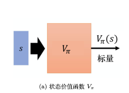

（此处标量代表actor Π遇到s后，预期到游戏结束，可以获得多大的奖励）

### 求状态价值函数的方法

#### Monte-Carlo(MC)

假设当前采取的策略为Π，我们要求状态S在该策略下的价值函数，那么我们就让演员Π在S下不停和环境交互，直到游戏结束，多次采样后取平均可以得到相应的标量。

那么这个问题就变成了一个回归问题，我们的输入数据为(X = S ,Y = 标量)，我们用这个数据去拟合神经网络即可

#### Temporal-difference(TD)

采用MC方法有一个缺点，就是我们在模拟的时候，必须玩到游戏结束，这是很慢的，采用TD方法，使我们只需下一步，就能得到$V_\pi(S_t)$的值

设在$S_t下采取动作a_t会获得奖励r，同时状态转到S_{t+1}$

我们基于以下公式求$V_\pi(S_t)$：
$$
V_\pi(S_t) = r + V_\pi(S_{t + 1}) \\
\Rightarrow V_\pi(S_t) - V_\pi(S_{t + 1}) = r
$$
所以我们的训练过程如下：

对神经网络分别输入状态$S_t和S_{t+1}得到V_\pi(S_{t}) 和V_\pi(S_{t + 1}) $，希望它们相减的损失与r接近。

#### 二者的区别

区别：MC的variance更大，TD的variance更小

==（原因：因为r时一个随机变量，而MC方法求得的Ga是多个r累加的结果，而TD方法中只有一个r）==

下面根据一个小例子理解二者的区别：

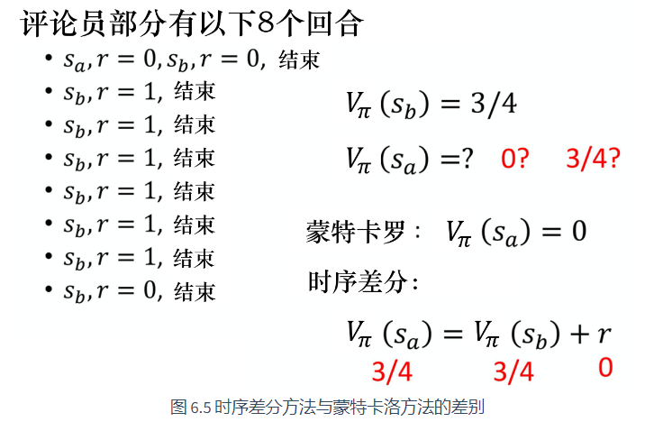

两种方法的Vb均为3/4

MC方法：Va为0(8场游戏仅有1场出现Sa，且价值为0)

TD方法：Va为3/4（Va = r + Vb , r = 0)

## 动作价值函数

与价值函数不同，动作价值函数是评估一个动作状态对的价值，即输入是动作状态对，输出是该动作状态对的价值。

其有两种写法（如下图所示）：

==1、输入是动作和状态，输出时一个标量，适合离散与连续的动作==

==2、输入是状态，输出多个值，适合离散动作==

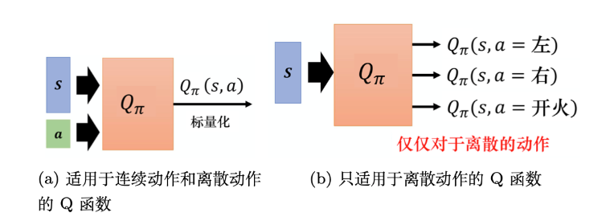

#### 动作价值函数的策略改进过程

总的来说如下图所示（设初始的actor为Π）：

==1、利用Π与环境交互，求得该actor对应的动作价值函数==

可以采用MC或TD方法，求得Q函数

==2、根据动作价值函数更新actor，得到Π'==

利用该公式更新actor(前提条件是a是离散的)

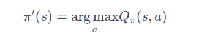

==3、利用Π'，回到1重复该过程==

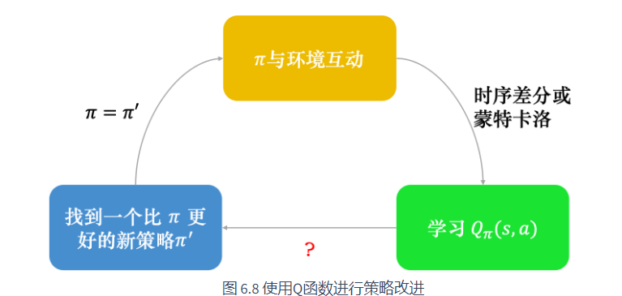

## 目标网络

在我们训练Q函数的时候，我们会用到TD的概念，即
$$
Q_\pi(S_t ,a_t) = r_t + Q_\pi(S_{t+1},\pi(S_{t+1}))
$$
如果将该训练看成一个回归训练的话，其实是不好训练的，因为目标一直在变（即等式右边）

所以我们可以采用下图的方法：

先将目标网络固定住，不更新其参数，在我们学习的网络更新一定次数后，再覆盖到目标网络，继续学习。

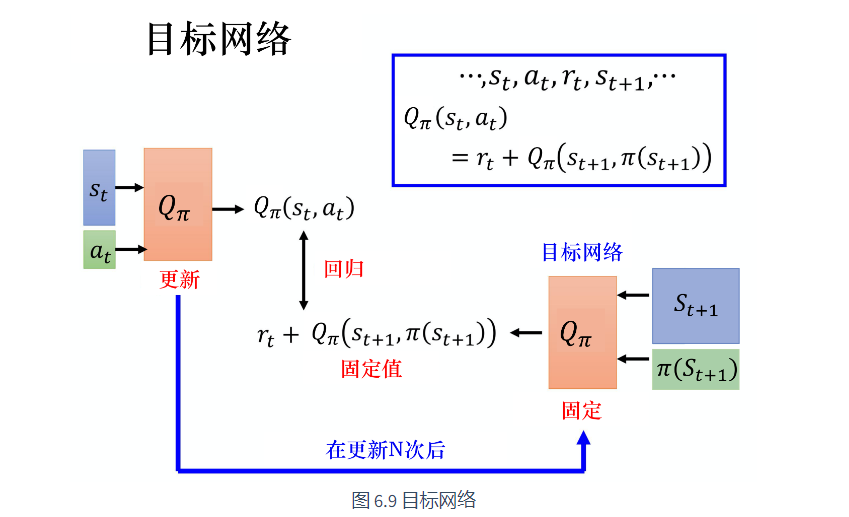

## 探索

由于我们是根据如下公式来采取动作a的，那么这样会产生一个问题

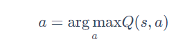

假设对于初始状态s，我们有如下三个动作(由于刚开始，故设Q值均为0)：

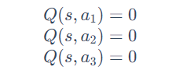

我们需要根据上面的公式选择一个动作，假设当前选择的动作为a2，计算后如下：

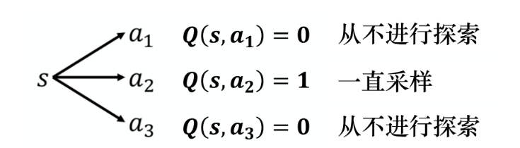

那么以后我们就会一直采样a2，而忽视a1和a3，所以我们需要加一些随机性，主要有以下两种方法：

1、$\epsilon-贪心$

根据如下公式：

通常ε是一个很小的值，比如0.1

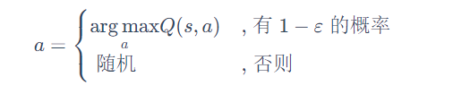

2、玻尔兹曼探索

采用如下公式：

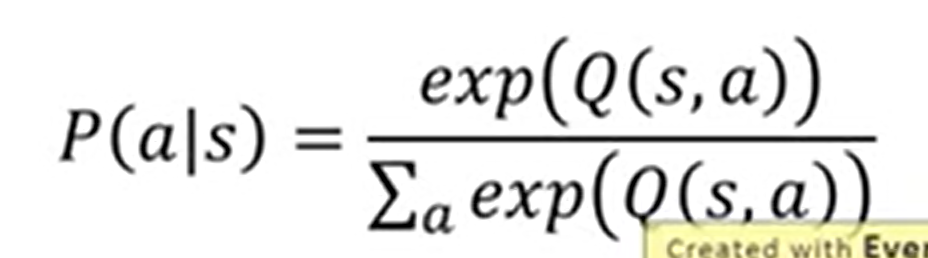

## 经验回放

流程如下：

我们利用Π和环境交互1w次，然后得到1w笔经验，每条经验包括$(S_t,a_t,r_t,S_{t+1})$,之后我们更新网络参数

更新方法：

在经验池中抽取一个batch，拿去更新网络

但是经验池可能能存5w笔经验，所以也就是说，我们更新Q网络利用的经验不一定只来自Π，还可能来自更早的策略。

经验池更新策略：满了之后淘汰旧的

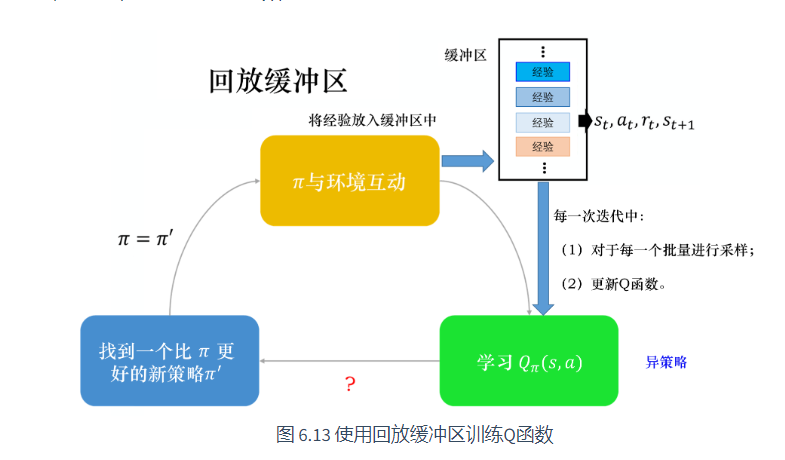

## 算法流程

1、设置网络$Q和\hat Q,且Q = \hat Q$

2、对于给定的状态$S_t$，根据策略(可以是ε-贪心)采取动作a,得到奖励r和下一个状态$S_{t+1}$，并将$(S_t,a_t,r_t,S_{t+1})$放入buffer

3、在buffer中采样经验(通常以batch的形式)，根据$Q(s_t , a) = r + \hat Q(s_{t+1} , \pi(S_{t+1}))$来更新Q

4、每隔c次将$\hat Q替换为Q$

## 进阶技巧

### DDQN

传统的深度Q网络会有高估问题，表格如下：

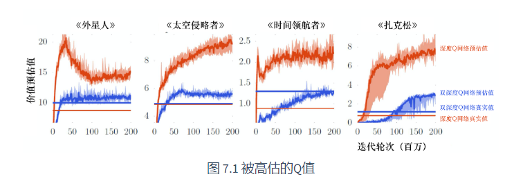

高估的原因如下：

首先我们更新Q采用如下公式：

由于网络是有误差的，所以有可能对于一个动作状态对，网络输出的值可能会高于实际值（绿色表示高估部分）

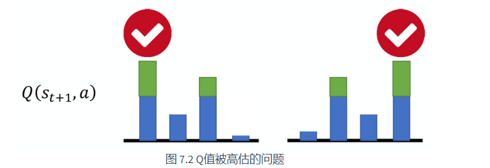

由于我们的选择策略的原因，我们总是会选择那些被高估的值来作为目标去更新Q，这就会导致Q值高估

解决方法：

采用两个Q网络:

1、其中一个网络Q负责选择动作，即执行$\mathop{\arg\max}\limits_{a}Q(S_{t+1},a)$

2、另一个网络$\hat Q$负责计算第一个网络选出的动作a对应的$\hat Q(S_{t+1},a)$

之后将$r+\hat Q(S_{t+1},a)$作为目标值

tips:直接将目标网络作为$\hat Q$即可，所以该方法很简便，不需要很多附加代码也不需要新加网络

### 竞争深度Q网络（dueling DQN)

与传统Q网络不同的仅仅是网络结构，如下图：

上面是传统的DQN，下面是dueling DQN

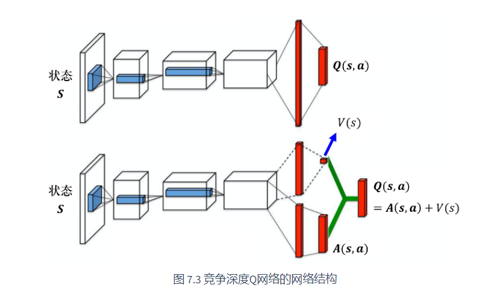

我们假设状态是离散的，有如下表格：

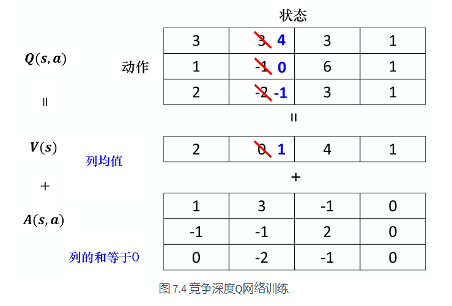

那么如果我们想将(1,2)和(2,2)由3和-1更新为4和0，我们只需要更新V(s)即可(将第二个数由0改为1)

这样会带来一个影响，就是(3,2)这个数会改为-1，也就是说，我们可以用少量的采样，更新更多的Q值

这样会带来一个问题，如果神经网络只更新A(S,a)，而V(S)全置0，那么不就退化到传统的DQN了吗

所以我们需要给A(S,a)的更新加一些限制，使网络更倾向于更新V(S)

限制：例如强制A(S,a)的每一列的和为0等

### 优先级经验回放

我们从经验池采样的过程中，有些经验是比较重要的，比如有些经验的TD error较大，那么我们应该给它高一些的优先级，这样更由利于训练

### TD和MC平衡的方法

TD方法是我们采取一步，得到经验$(S_t,a_t,r_t,S_{t+1})$，现在我们可以将二者结合，我们可以采取N步，得到经验$(S_t,a_t,r_t,S_{t+1},......,S_{t+N-1},a_{t+N-1},r_{t+N-1},S_{t+N})$

之后再拿去训练，训练过程如下所示：

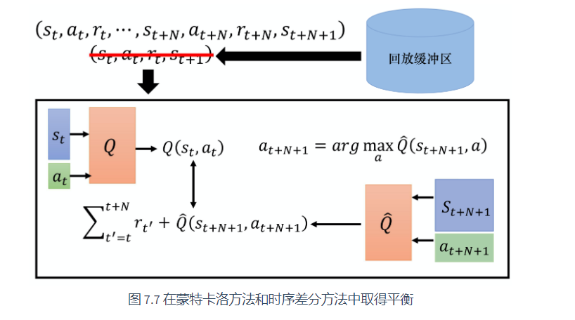

### 噪声网络

每次进行一个episode之前给Q网络加一些噪声，它和之前的ε-贪心方法的区别是，ε-贪心做决定与状态无关，即使是同一个状态，也可能做出不同的决定，而噪声网络对于同一个状态s，执行的动作是相同的

相比于ε-贪心方法，噪声网络是更加系统的去探索的方法

### 分布式Q函数

如下图所示：

传统DQN，输出的是标量，而分布式Q函数输出的是概率分布，这样可以保留更多信息(比如可以知道哪个动作的方差大等，为后续选择动作提供了更多的信息)

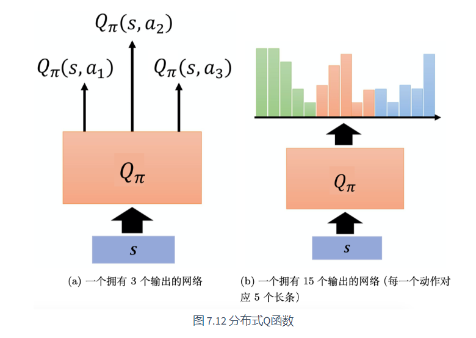

### rainbow

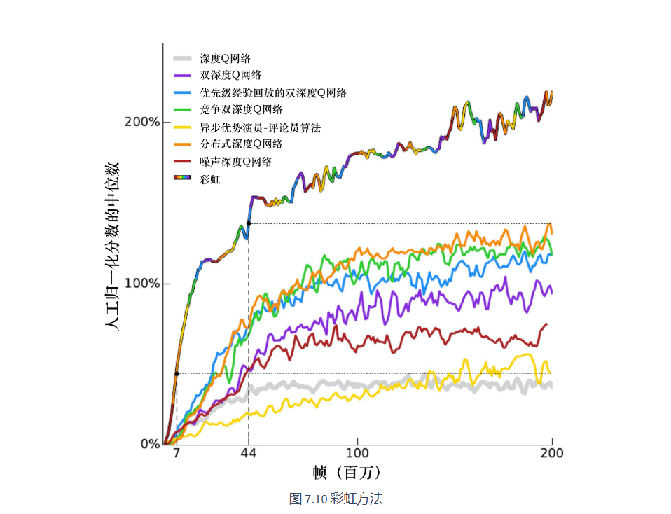

所有方法结合起来