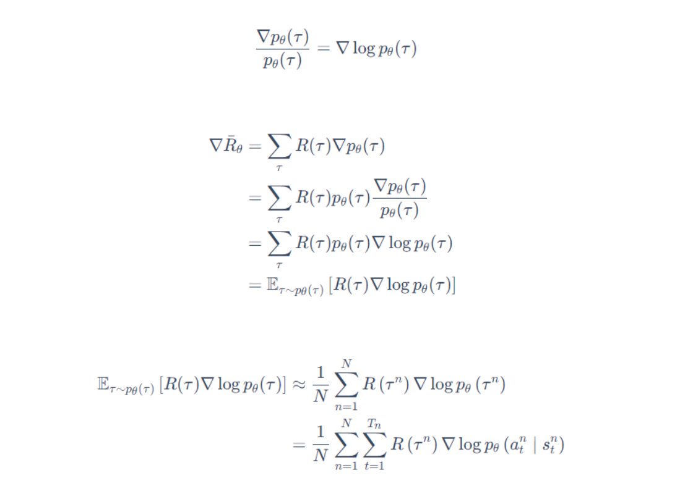

# 策略梯度

首先我们先介绍一下什么是策略梯度算法，之后我们再介绍一些实现技巧。

## 策略梯度介绍

### 强化学习的组成

在强化学习的过程中，我们有三个因素，即演员，奖励，环境。

演员我们可以想象成一个黑箱网络，其由参数θ决定，输入时当前游戏的状态state，输出是一个动作。

环境也是一个函数，输入是动作，输出是执行该动作后的下一个状态以及评分（该评分是上一个状态下执行动作的评分）

奖励就是环境输出的那个评分。

### 评价网络参数θ的基准

在一场游戏里，agent会不断与环境交互，演员会收到一些列的状态s，并针对该状态s做出动作a，我们可以把一场游戏的状态和动作组合起来，称之为轨迹r：

对于该轨迹来说，我们可以计算出该轨迹出现的的概率$p_\theta(r)$

其中涉及状态转移的部分是由环境决定（如P(s2|s1,a1)) ， 所以这个概率只与θ有关

这条轨迹还会伴随着一系列的奖励，我们把这些奖励加起来，作为这条轨迹的奖励

那么对于参数θ控制的网络，其可以获得的奖励期望就是我们穷举所有的轨迹，算出轨迹的奖励并乘以相应的概率，最后求和：

可见该期望函数是一个以θ的为参数的函数，我们的目的是使得奖励最大，那么我们就可以通过梯度上升来修改θ，来达到我们增大期望的目的。

上式的梯度计算如下(其中只有θ是参数，故梯度符号可以给到$P_\theta(r)$前)：

又有如下公式：

将上述两个式子整理后，我们可得：

整合(1)(3)我们有以下推导：

其中后半部分梯度的转换以及多出来的Σ求和，可以参见如下推导：

解释：分开后三项里面一、三为常数项（不带变量θ），故梯度为0

之后我们可以通过该梯度进行更新，由于我们要求最大值，随意加上梯度（乘以学习率η）

==注意：==

这里的$R(r^n)$是针对轨迹而言，也就是一局游戏结束后，我们获得的奖励，即对于同一局游戏中的所有动作状态对，$R(r^n)$是相同的。

==实现细节：==

我们可以将演员的策略网络看成一个分类网络，即输入当前的状态s，输出动作a

在分类里面，我们需要最小化的是损失，也就是

那么也就是我们需要最大化对数似然：
$$
J = \sum_{i=1}^{K}y_{i}*log(p_i)
$$
现在我们要最大化奖励的期望：

我们将其转换一下，在前面乘以个权重（奖励），就可以得到新的损失公式：

我们的目的就是在网络中调整参数θ以最大化该公式，直观来讲，如果一个轨迹的奖励值是正的，那么我们会增大该轨迹上的各点被选择的概率

## 实现技巧

### 增加基线

由于有的游戏里面，奖励可能是都为正的，只不过大小不同，以反映不同动作之间的好坏。

那么会有一个问题，我们难道要提高所有动作的概率吗，这样显然是不合理的

考虑上图，由于abc三个动作的奖励值不同，所以提升的幅度不同，在归一化之后，提升幅度最小的b相当于减少了

那么会引出一个新的问题，如果a动作运气好没被采样到，这样归一化后，它的概率也会减少，这肯定是不合理的，因为没选过a不代表a不好，所以我们引出==基线==的概念

所谓基线，就是给奖励都减去一个bias，使得它们有正有负，通常b取值是已采样出的轨迹r的奖励的平均值。

### 分配合适的分数

考虑下图，有这样一个问题，如果整个轨迹的奖励是正的，那么代表这个轨迹上的每个动作状态对都是好的吗，答案显然不是，那么我们怎样避免这个问题呢？

我们可以采用如下方法，对于一条轨迹，我们可以认为，对于一个动作状态对来说，只有这条轨迹的且位于该动作状态对之后的动作状态对才受该动作状态对影响。也就是我们在计算一个动作状态对的价值的时候，我们只考虑该动作状态对及其之后的动作状态对。

由于离该动作状态对越远的动作状态对受该动作状态对的影响越小，所以乘以一个折扣因子γ